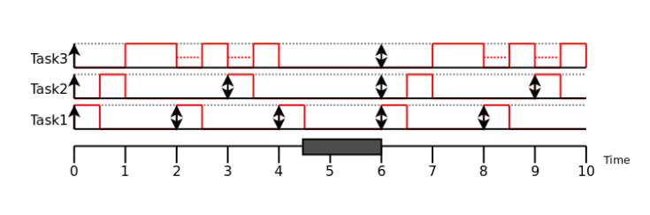
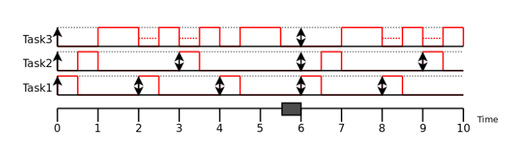
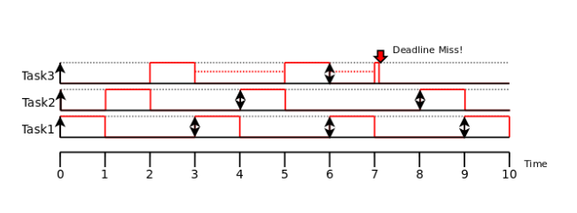

# Example 1

### Task properties

| Task  | Execution time (Ci) | Period (Ti) |
|---:|---:|---:|
| 1 | 0.5 | 2 |
| 2 | 0.5 | 3 |
| 3 | 2 | 6 |

The total utilization is:

$$
U = \sum_i \frac{C_i}{T_i}
  = \frac{0.5}{2} + \frac{0.5}{3} + \frac{2}{6}
  = 0.75 = 75\%.
$$

In other words, the CPU is busy 75% of the time.

For n = 3, the Liu–Layland utilization bound is:

$$
U_{lub}(3) = 3\left(2^{1/3} - 1\right)
           \approx 0.78 = 78\%.
$$

Since the utilization (0.75) is below the bound (0.78), one execution per period is guaranteed.

# Example 2

### Task properties

| Task  | Execution time (Ci) | Period (Ti) |
|---:|---:|---:|
| 1 | 0.5 | 2 |
| 2 | 0.5 | 3 |
| 3 | 3 | 6 |

The total utilization is:

$$
U = \sum_i \frac{C_i}{T_i}
  = \frac{0.5}{2} + \frac{0.5}{3} + \frac{3}{6}
  \approx 0.92 = 92\%.
$$

For three tasks, the U_lub bound is approximately 0.78 (78%), as above.

Since the utilization (0.92) is above the bound (0.78), the utilization-bound test cannot guarantee schedulability. However, the task set is schedulable.

# Example 3

### Task properties

| Task  | Execution time (Ci) | Period (Ti) |
|---:|---:|---:|
| 1 | 1 | 3 |
| 2 | 1 | 4 |
| 3 | 2.1 | 6 |

The total utilization is:

$$
U = \sum_i \frac{C_i}{T_i}
  = \frac{1}{3} + \frac{1}{4} + \frac{2.1}{6}
  \approx 0.93 = 93\%.
$$

For three tasks, the U_lub bound is approximately 0.78 (78%), as above.

Since the utilization (0.93) is above the bound (0.78), the utilization-bound test cannot guarantee schedulability, and this task set is not schedulable.

# Harmonic Periods

No caso de um conjunto de tarefas com períodos harmônicos, isto é, quando os períodos maiores são múltiplos inteiros dos peíodos menores, desde que a soma das utilizações seja menor ou igual a 1, o conjunto de tarefas é garantidamente escalonável. 